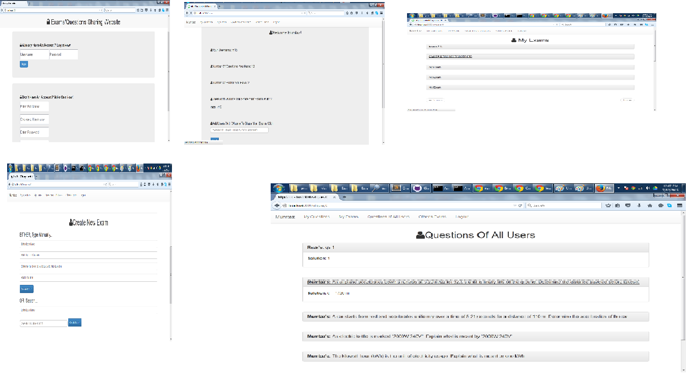

# ExamSharingNodeJS

Project Description:
Web app developed using NodeJS and mongodb database. Users signup and login.
Then they can do various things:
	- Add questions
	- View other user's questions
	- Create Exams. Option to questions choose from my questions bank and other user's question bank.
	- View those user's exams who chose to share their exams with you. You cannot view exams of those users who did not choose to share their exams with you.
	- View an exam and its solution in printable format
	- Share your exams with chosen users.

Running the Project:
Open command prompt in any dir, then type:
	path1 --dbpath "path2"
path1 = path to mongod.exe = C:\Users\Nadeem\Downloads\Compressed\mongodb-win32-x86_64-2008plus-2.6.3\mongodb-win32-x86_64-2008plus-2.6.3\bin\mongod.exe
path2 = Path to local database = C:\Users\Nadeem\Documents\GitHub\ExamSharingNodeJS\test3\data

Open command prompt in project dir, then type:
	node app.js
Output: "listening on port 3000"
Open browser, go to: localhost:3000. Woila!

Below are some snapshots from the working app:

 

